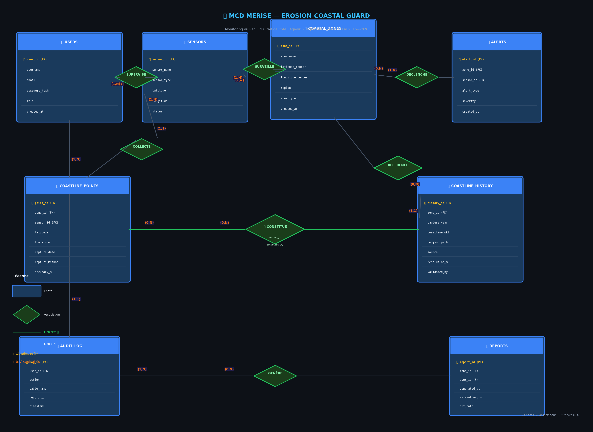

# 🌊 Module MCD MERISE — Erosion-Coastal Guard
### Monitoring du Recul du Trait de Côte · Agadir & Taghazout · Souss-Massa 2016→2026

> **Projet** : SIBD — Souss-Massa Resilience Prototype  
> **Équipe** : Équipe 9 | Architects   
> **Encadrant** : Pr. S. EL-ATEIF 
> **Année** : 2025–2026

---

## Table des Matières

1. [Introduction à MERISE](#1-introduction-à-merise)
2. [Concepts fondamentaux](#2-concepts-fondamentaux-du-mcd)
3. [Les 9 Entités du MCD](#3-les-9-entités-du-mcd)
4. [Les 8 Associations](#4-les-8-associations)
5. [Diagramme MCD complet](#5-diagramme-mcd-complet-png)
6. [Règles de passage MCD → MLD](#6-règles-de-passage-mcd--mld)
7. [Les 10 Tables du MLD](#7-les-10-tables-du-mld)
8. [Schéma MLD final](#8-schéma-mld-final)
   

---

## 1. Introduction à MERISE

**MERISE** (Méthode d'Étude et de Réalisation Informatique pour les Systèmes d'Entreprise) est une méthode française de conception de systèmes d'information développée dans les années 1970–80. Elle structure la modélisation en deux niveaux distincts et complémentaires :

```
NIVEAU CONCEPTUEL          NIVEAU LOGIQUE           NIVEAU PHYSIQUE
       │                        │                         │
    MCD                       MLD                       MPD
(Quoi ?)              (Comment logiquement ?)     (Comment en SQL ?)
Entités + Relations    Tables + Clés étrangères     Scripts CREATE TABLE
```

### Pourquoi MERISE pour Erosion-Coastal Guard ?

| Besoin du projet | Réponse MERISE |
|---|---|
| Modéliser des zones géographiques côtières | Entités `COASTAL_ZONES` |
| Comparer mesures 2016 vs 2026 | Association N:M `CONSTITUE` |
| Calculer le recul par Haversine | Table pivot `RETREAT_MEASUREMENTS` |
| Gérer les droits d'accès (RBAC) | Entité `USERS` avec attribut `role` |
| Tracer les actions (Audit) | Entité `AUDIT_LOG` |

---

## 2. Concepts Fondamentaux du MCD

### 2.1 Entité

> Une **entité** représente un **objet réel** du domaine métier, identifiable et distinct.

```
┌─────────────────────┐
│    NOM_ENTITE       │  ← Titre en majuscules
├─────────────────────┤
│ # identifiant (PK)  │  ← Clé primaire (soulignée)
│   attribut_1        │  ← Propriété
│   attribut_2        │  ← Propriété
└─────────────────────┘
```

**Règle** : Chaque entité doit avoir une **clé primaire unique** (identifiant souligné dans MERISE).

---

### 2.2 Association

> Une **association** représente un **lien sémantique** entre deux ou plusieurs entités.

```
ENTITE_A ────────◇────────── ENTITE_B
         (0,N) ASSOC (1,1)
```

Elle peut avoir ses propres **attributs** (données portées par la relation elle-même).

---

### 2.3 Cardinalités — La clé de lecture du MCD

Les cardinalités `(min, max)` se lisent **depuis l'entité vers l'association** :

| Notation | Signification |
|---|---|
| `(0,1)` | L'entité participe à **au minimum 0** et **au maximum 1** occurrence |
| `(1,1)` | L'entité participe à **exactement 1** occurrence (obligatoire, unique) |
| `(0,N)` | L'entité participe à **au minimum 0** et **autant** d'occurrences que nécessaire |
| `(1,N)` | L'entité participe à **au minimum 1** et **autant** d'occurrences que nécessaire |

**Exemple métier du projet** :
```
COASTAL_ZONES ──(0,N)── REFERENCE ──(1,1)── COASTLINE_HISTORY

Lecture : Une zone peut avoir 0 ou N tracés historiques.
          Un tracé historique appartient à exactement 1 zone.
```

---

### 2.4 Types de relations selon les cardinalités

```
Type        Cardinalités        Traduction MLD
────────────────────────────────────────────────────────
1:1         (1,1) — (1,1)      Fusion des tables OU FK dans l'une
1:N         (1,1) — (0,N)      FK dans la table "côté 1"
N:M  ★      (0,N) — (0,N)      TABLE PIVOT obligatoire
```

> **★ Important** : Dans Erosion-Coastal Guard, la seule relation N:M est `CONSTITUE`
> → Elle génère la 10ème table `RETREAT_MEASUREMENTS`.

---

## 3. Les 9 Entités du MCD

### 3.1 USERS — Utilisateurs du système

```
┌──────────────────────────────┐
│           USERS              │
├──────────────────────────────┤
│ # user_id        INT PK      │
│   username       VARCHAR(50) │
│   email          VARCHAR(100)│
│   password_hash  VARCHAR(255)│
│   role           ENUM        │  ← admin | architecte | augmented | viewer
│   created_at     DATETIME    │
└──────────────────────────────┘
```

**Rôle métier** : Gère l'authentification et le contrôle d'accès RBAC. L'attribut `role` différencie les Architectes (saisie manuelle) des Augmenteds (saisie IA).

---

### 3.2 SENSORS — Capteurs de terrain

```
┌──────────────────────────────┐
│           SENSORS            │
├──────────────────────────────┤
│ # sensor_id      INT PK      │
│   sensor_name    VARCHAR(100)│
│   sensor_type    ENUM        │  ← GPS | drone | satellite | LIDAR
│   latitude       DECIMAL(9,6)│
│   longitude      DECIMAL(9,6)│
│   status         ENUM        │  ← actif | inactif | maintenance
│   installed_at   DATETIME    │
└──────────────────────────────┘
```

**Rôle métier** : Représente le dispositif physique collectant les points GPS. Un capteur peut équiper plusieurs zones.

---

### 3.3 COASTAL_ZONES — Zones côtières

```
┌──────────────────────────────┐
│        COASTAL_ZONES         │
├──────────────────────────────┤
│ # zone_id         INT PK     │
│   zone_name       VARCHAR    │  ← "Plage Taghazout Nord"
│   latitude_center DECIMAL    │
│   longitude_center DECIMAL   │
│   region          VARCHAR    │  ← "Souss-Massa"
│   zone_type       ENUM       │  ← sableux | rocheux | mixte
│   created_at      DATETIME   │
└──────────────────────────────┘
```

**Rôle métier** : Référentiel géographique stable. C'est l'**entité centrale** autour de laquelle s'organisent toutes les données.

---

### 3.4 COASTLINE_POINTS — Points GPS 2026

```
┌──────────────────────────────┐
│      COASTLINE_POINTS        │
├──────────────────────────────┤
│ # point_id       INT PK      │
│   zone_id        INT FK      │
│   sensor_id      INT FK      │
│   latitude       DECIMAL(9,6)│
│   longitude      DECIMAL(9,6)│
│   altitude_m     FLOAT       │
│   capture_date   DATE        │
│   capture_method ENUM        │  ← GPS | drone | satellite | LIDAR
│   accuracy_m     FLOAT       │
│   collected_by   VARCHAR     │
│   created_at     DATETIME    │
└──────────────────────────────┘
```

**Rôle métier** : **Données terrain actuelles (2026)**. Ce sont les points de la côte mesurés aujourd'hui. Ils forment la "moitié présente" du calcul Haversine.

---

### 3.5 COASTLINE_HISTORY — Tracés historiques 2016

```
┌──────────────────────────────┐
│      COASTLINE_HISTORY       │
├──────────────────────────────┤
│ # history_id     INT PK      │
│   zone_id        INT FK      │
│   capture_year   YEAR        │  ← 2016 (référence décennale)
│   geojson_path   TEXT        │
│   coastline_wkt  TEXT        │  ← LINESTRING géométrique
│   source         VARCHAR     │  ← Landsat, Sentinel-2...
│   resolution_m   FLOAT       │
│   validated_by   VARCHAR     │
│   created_at     DATETIME    │
└──────────────────────────────┘
```

**Rôle métier** : **Ligne de base temporelle (2016)**. Sans elle, impossible de calculer le recul. C'est la "moitié passée" du calcul Haversine.

---

### 3.6 ALERTS — Alertes d'érosion

```
┌──────────────────────────────┐
│           ALERTS             │
├──────────────────────────────┤
│ # alert_id       INT PK      │
│   zone_id        INT FK      │
│   sensor_id      INT FK      │
│   alert_type     ENUM        │  ← erosion | submersion | glissement
│   severity       ENUM        │  ← faible | modere | critique
│   message        TEXT        │
│   is_resolved    BOOLEAN     │
│   created_at     DATETIME    │
└──────────────────────────────┘
```

**Rôle métier** : Notifications automatiques générées lorsque le recul dépasse un seuil critique.

---

### 3.7 AUDIT_LOG — Journal d'audit

```
┌──────────────────────────────┐
│          AUDIT_LOG           │
├──────────────────────────────┤
│ # log_id         INT PK      │
│   user_id        INT FK      │
│   action         ENUM        │  ← INSERT | UPDATE | DELETE | LOGIN
│   table_name     VARCHAR     │
│   record_id      INT         │
│   old_values     JSON        │
│   new_values     JSON        │
│   ip_address     VARCHAR     │
│   timestamp      DATETIME    │
└──────────────────────────────┘
```

**Rôle métier** : Sécurité minimale — trace toutes les actions utilisateurs. Permet de distinguer les insertions Architectes des insertions IA (Augmenteds).

---

### 3.8 REPORTS — Rapports générés

```
┌──────────────────────────────┐
│          REPORTS             │
├──────────────────────────────┤
│ # report_id      INT PK      │
│   zone_id        INT FK      │
│   user_id        INT FK      │
│   generated_at   DATETIME    │
│   retreat_avg_m  FLOAT       │  ← Moyenne Haversine sur la zone
│   retreat_max_m  FLOAT       │
│   pdf_path       TEXT        │
│   report_type    ENUM        │  ← mensuel | annuel | decennal
└──────────────────────────────┘
```

**Rôle métier** : Synthèses exportables pour le dashboard et les autorités côtières.

---

### 3.9 RETREAT_MEASUREMENTS — Table pivot N:M ★

> **Cette entité est générée par la règle de passage MCD→MLD** (voir section 6).
> Elle n'existe pas dans le MCD mais résulte de l'association N:M `CONSTITUE`.

```
┌──────────────────────────────┐
│    RETREAT_MEASUREMENTS      │  ← 10ème table du MLD
├──────────────────────────────┤
│ # point_id       INT FK(PK)  │
│ # history_id     INT FK(PK)  │
│   lat_2016       DECIMAL     │
│   lon_2016       DECIMAL     │
│   lat_2026       DECIMAL     │
│   lon_2026       DECIMAL     │
│   retreat_m      FLOAT       │  ← Résultat Haversine (auto via trigger)
│   retreat_dir    FLOAT       │  ← Azimut en degrés
│   computed_by    ENUM        │  ← 'manuel' | 'IA'
│   computed_at    DATETIME    │
└──────────────────────────────┘
```

---

## 4. Les 8 Associations

| # | Association | Entités liées | Cardinalités | Type |
|---|---|---|---|---|
| 1 | `SUPERVISE` | USERS — SENSORS | (0,N) — (1,N) | N:M simplifié |
| 2 | `SURVEILLE` | SENSORS — COASTAL_ZONES | (1,N) — (1,N) | N:M |
| 3 | `DÉCLENCHE` | COASTAL_ZONES — ALERTS | (0,N) — (1,N) | 1:N |
| 4 | `COLLECTE` | SENSORS — COASTLINE_POINTS | (1,N) — (1,1) | 1:N |
| 5 | `REFERENCE` | COASTLINE_HISTORY — COASTAL_ZONES | (1,1) — (0,N) | 1:N |
| 6 | **`CONSTITUE ★`** | **COASTLINE_POINTS — COASTLINE_HISTORY** | **(0,N) — (0,N)** | **N:M** |
| 7 | `GÉNÈRE` | USERS — REPORTS | (1,N) — (0,N) | N:M |
| 8 | `EFFECTUE` | USERS — AUDIT_LOG | (1,N) — (1,1) | 1:N |

> **★ CONSTITUE** est l'unique association N:M "pure" du MCD. C'est elle qui génère la table pivot `RETREAT_MEASUREMENTS` avec les colonnes Haversine.

---

## 5. Diagramme MCD Complet (PNG)



> *Diagramme généré automatiquement. Les entités bleues sont les tables principales,
> les losanges verts sont les associations. Le lien vert épais ★ représente la relation N:M.*

---

## 6. Règles de Passage MCD → MLD

Le passage du MCD au MLD suit **4 règles MERISE strictes** :

---

### Règle 1 — Entité → Table

> **Toute entité du MCD devient une table dans le MLD.**
> Sa clé primaire reste clé primaire.

```
MCD :  Entité COASTAL_ZONES { zone_id (PK), zone_name, ... }
MLD :  TABLE  coastal_zones (zone_id PK, zone_name, ...)
```

---

### Règle 2 — Association 1:N → Clé Étrangère

> **Une association de type 1:N ne génère PAS de nouvelle table.**
> La clé primaire de l'entité "côté 1" migre comme **clé étrangère**
> dans la table "côté N".

```
MCD :
  COASTAL_ZONES ──(0,N)── REFERENCE ──(1,1)── COASTLINE_HISTORY

  Lecture : Une zone → N historiques   (côté COASTLINE_HISTORY est "N")
            Un historique → 1 zone     (côté COASTAL_ZONES est "1")

MLD :
  TABLE coastline_history (
      history_id PK,
      zone_id    FK → coastal_zones(zone_id),   ← FK migre ici
      ...
  )
```

**Pourquoi dans `COASTLINE_HISTORY` ?** Car c'est l'entité "côté (1,1)" — l'entité obligée d'avoir une zone.

---

### Règle 3 — Association N:M → Table Pivot ★

> **Toute association N:M génère une nouvelle table intermédiaire.**
> Cette table contient les **clés primaires des deux entités** comme clé primaire composite,
> **plus les attributs propres à l'association**.

```
MCD :
  COASTLINE_POINTS ──(0,N)── CONSTITUE ──(0,N)── COASTLINE_HISTORY
                             [retreat_m, computed_by]  ← attributs de l'asso

MLD :  Génère la 10ème table →

  TABLE retreat_measurements (
      point_id    FK → coastline_points(point_id),   ← PK composite
      history_id  FK → coastline_history(history_id), ← PK composite
      lat_2016, lon_2016, lat_2026, lon_2026,
      retreat_m,      ← calculé par trigger Haversine
      computed_by,    ← 'manuel' | 'IA'
      PRIMARY KEY (point_id, history_id)
  )
```

---

### Règle 4 — Association 1:1 → Fusion ou FK

> **Une association 1:1 peut fusionner les deux tables** ou placer la FK dans l'une des deux.
> On choisit en général la table la moins importante comme "fille".

```
MCD :  ENTITE_A ──(1,1)── LIEN ──(1,1)── ENTITE_B

MLD :  Option A → fusionner A et B en une seule table
       Option B → ajouter FK de A dans B (ou inversement)
```

> Dans notre projet, aucune relation strictement 1:1 n'est présente.

---

### Récapitulatif visuel des règles

```
MCD                          RÈGLE              MLD
─────────────────────────────────────────────────────────────────
Entité                  →  R1 : Table        →  TABLE
Association 1:N         →  R2 : FK migrée    →  FK dans table "N"
Association N:M    ★    →  R3 : Table pivot  →  TABLE PIVOT (PK composite)
Association 1:1         →  R4 : Fusion / FK  →  TABLE unique ou FK
```

---

## 7. Les 10 Tables du MLD

Application des règles sur les 9 entités + 1 table pivot :

| # | Table MLD | Origine | Règle |
|---|---|---|---|
| 1 | `users` | Entité USERS | R1 |
| 2 | `sensors` | Entité SENSORS | R1 |
| 3 | `coastal_zones` | Entité COASTAL_ZONES | R1 |
| 4 | `coastline_points` | Entité COASTLINE_POINTS | R1 |
| 5 | `coastline_history` | Entité COASTLINE_HISTORY | R1 |
| 6 | `alerts` | Entité ALERTS | R1 |
| 7 | `audit_log` | Entité AUDIT_LOG | R1 |
| 8 | `reports` | Entité REPORTS | R1 |
| 9 | `sensor_zones` | Association N:M SURVEILLE | R3 |
| **10** | **`retreat_measurements`** | **Association N:M CONSTITUE ★** | **R3** |

---

### Scripts SQL des tables clés

```sql
-- ─── TABLE 3 : COASTAL_ZONES (entité centrale) ───
CREATE TABLE coastal_zones (
    zone_id          INT PRIMARY KEY AUTO_INCREMENT,
    zone_name        VARCHAR(100) NOT NULL,
    latitude_center  DECIMAL(9,6) NOT NULL,
    longitude_center DECIMAL(9,6) NOT NULL,
    region           VARCHAR(50)  DEFAULT 'Souss-Massa',
    zone_type        ENUM('sableux','rocheux','mixte') NOT NULL,
    created_at       DATETIME     DEFAULT CURRENT_TIMESTAMP
);

-- ─── TABLE 5 : COASTLINE_HISTORY (Règle R2 — FK zone_id) ───
CREATE TABLE coastline_history (
    history_id   INT PRIMARY KEY AUTO_INCREMENT,
    zone_id      INT  NOT NULL,
    capture_year YEAR NOT NULL,
    coastline_wkt TEXT,
    geojson_path  TEXT,
    source        VARCHAR(100),
    resolution_m  FLOAT,
    validated_by  VARCHAR(50),
    created_at    DATETIME DEFAULT CURRENT_TIMESTAMP,

    CONSTRAINT fk_history_zone
        FOREIGN KEY (zone_id) REFERENCES coastal_zones(zone_id)
        ON DELETE RESTRICT ON UPDATE CASCADE
);

-- ─── TABLE 4 : COASTLINE_POINTS (Règle R2 — FK zone_id + sensor_id) ───
CREATE TABLE coastline_points (
    point_id       INT PRIMARY KEY AUTO_INCREMENT,
    zone_id        INT  NOT NULL,
    sensor_id      INT,
    latitude       DECIMAL(9,6) NOT NULL,
    longitude      DECIMAL(9,6) NOT NULL,
    altitude_m     FLOAT,
    capture_date   DATE  NOT NULL,
    capture_method ENUM('GPS','drone','satellite','LIDAR') NOT NULL,
    accuracy_m     FLOAT,
    collected_by   VARCHAR(50),
    created_at     DATETIME DEFAULT CURRENT_TIMESTAMP,

    CONSTRAINT fk_point_zone   FOREIGN KEY (zone_id)   REFERENCES coastal_zones(zone_id),
    CONSTRAINT fk_point_sensor FOREIGN KEY (sensor_id) REFERENCES sensors(sensor_id)
);

-- ─── TABLE 10 : RETREAT_MEASUREMENTS (Règle R3 — Table pivot N:M ★) ───
CREATE TABLE retreat_measurements (
    point_id    INT NOT NULL,
    history_id  INT NOT NULL,

    -- Coordonnées comparées
    lat_2016    DECIMAL(9,6) NOT NULL,
    lon_2016    DECIMAL(9,6) NOT NULL,
    lat_2026    DECIMAL(9,6) NOT NULL,
    lon_2026    DECIMAL(9,6) NOT NULL,

    -- Résultat Haversine (calculé par trigger)
    retreat_m   FLOAT,
    retreat_dir FLOAT,                             -- azimut en degrés
    computed_by ENUM('manuel','IA') NOT NULL,
    computed_at DATETIME DEFAULT CURRENT_TIMESTAMP,

    PRIMARY KEY (point_id, history_id),            -- PK composite

    CONSTRAINT fk_rm_point   FOREIGN KEY (point_id)   REFERENCES coastline_points(point_id)
                              ON DELETE CASCADE ON UPDATE CASCADE,
    CONSTRAINT fk_rm_history FOREIGN KEY (history_id) REFERENCES coastline_history(history_id)
                              ON DELETE CASCADE ON UPDATE CASCADE
);
```

---

## 8. Schéma MLD Final

```
users(1) ────────────────────────────────── audit_log(8)
  │ user_id PK                                  │ user_id FK
  │                                             │
  │ reports(8)                                  │
  │   user_id FK                                │
  │   zone_id FK ──────────────────────────┐    │
  │                                        │    │
sensors(2)                           coastal_zones(3)
  │ sensor_id PK                          │ zone_id PK
  │                                       │
  ├── sensor_zones(9) [FK sens + zone]    ├── coastline_history(5)
  │   sensor_id FK                        │    history_id PK
  │   zone_id   FK                        │    zone_id FK
  │                                       │         │
  └── coastline_points(4)                 │         │
       point_id PK                        │         │
       zone_id  FK ─────────────────────► │         │
       sensor_id FK                       │         │
            │                             │         │
            └────────► retreat_measurements(10) ◄───┘
                          point_id   FK (PK)
                          history_id FK (PK)
                          lat_2016, lon_2016
                          lat_2026, lon_2026
                          retreat_m  ← HAVERSINE()
                          computed_by ← 'manuel'|'IA'

alerts(6)
  zone_id   FK → coastal_zones
  sensor_id FK → sensors
```


## Ressources complémentaires

- `mcd_merise.png` — Diagramme MCD complet (ce répertoire)
- `schema_mld.sql` — Scripts SQL complets des 10 tables
- `trigger_haversine.sql` — Trigger de calcul automatique du recul
- `rbac_minimal.sql` — Vues et permissions RBAC
- `mock_data.sql` — Données GPS simulées pour Agadir & Taghazout

---

*Généré pour le module SIBD — Souss-Massa Resilience Prototype — ENSIASD Taroudant — 2025/2026*
